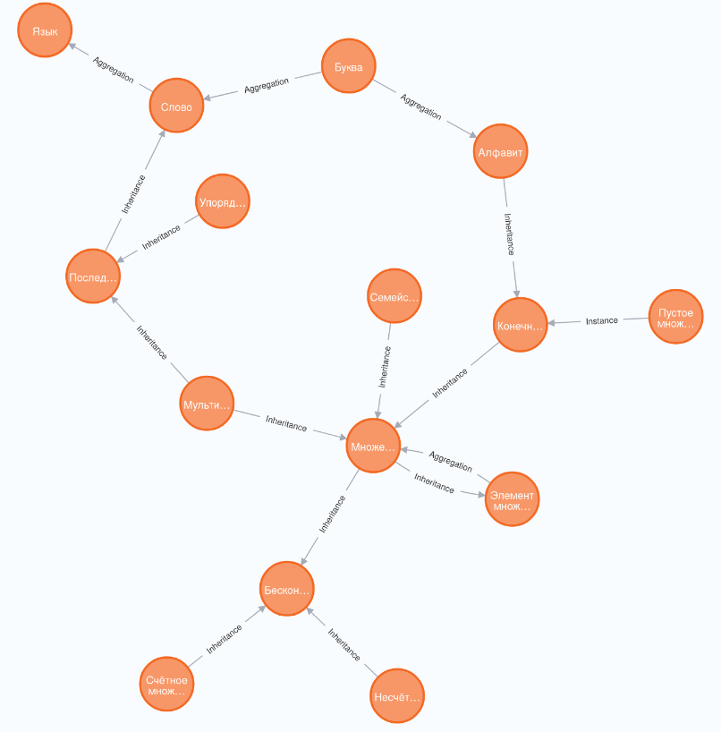

# Отчёт к занятию 21.10
* Установлена большая языковая модель qwen2 на 4 млрд параметров
* Установлена графовая СУБД neo4j - нужна для хранения онтологий и генерации промтов
* Изучен язык запросов к neo4j Cypher
* Был разработан [формат хранения онтологии](https://github.com/aVorotnikov/ontologer/blob/master/docs/ontologies.md)
* Была создана база данных, частично представляющая онтологию наивной теории множеств 
* Сформулированы [требования к утилите загрузки онтологии в БД](https://github.com/aVorotnikov/ontologer/blob/master/ontology_inserter/README.md)

Ближайшии планы:
* Согласно требования сформировать файлы с представлением онтологий
* Сделать утилиту загрузки онтологий
* Сделать библиотеку генерации промтов по онтологии
